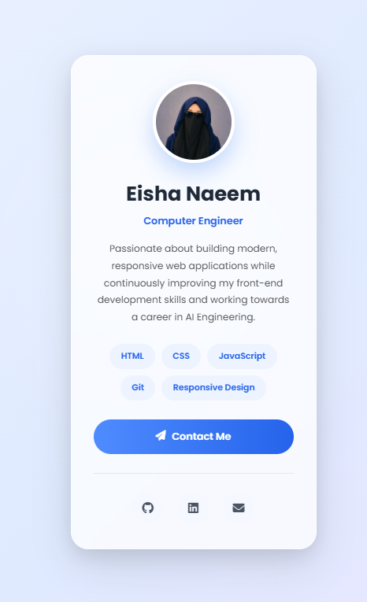

#  Modern Profile Card

A modern, responsive personal profile card built using **HTML5** and **CSS3**. This project showcases a clean UI with glassmorphism, gradient backgrounds, smooth hover animations, and a mobile-first responsive layout.

## 📸 Preview



## ✨ Features

- 🎨 Modern Glassmorphism UI
- 📱 Fully Responsive Design
- 👤 Circular Profile Image
- 🏷️ Interactive Skill Tags
- 📩 Contact Button
- 🔗 Social Media Links
- 🌈 Gradient Background
- ✨ Smooth Hover Animations
- ♿ Semantic HTML Structure

---

## 🛠️ Built With

- HTML5
- CSS3
- Google Fonts (Poppins)
- Font Awesome Icons

---

## 📂 Project Structure

```
profile-card/
│
├── index.html
├── style.css
├── README.md
│
└── images/
    └── myprof.jpeg
```

---

## 🚀 Getting Started

Clone the repository

```bash
git clone https://github.com/Eisha017/profile-card.git
```

Move into the project

```bash
cd profile-card
```

Open `index.html` in your browser.

---

## 📱 Responsive Design

The layout is optimized for:

- 💻 Desktop
- 💻 Laptop
- 📱 Tablet
- 📱 Mobile

---

## 🎯 Learning Objectives

This project helped strengthen my understanding of:

- Semantic HTML
- CSS Flexbox
- Responsive Design
- Glassmorphism
- CSS Gradients
- Hover Effects
- CSS Transitions
- UI Design Principles

---

## 🌐 Live Demo

Add your GitHub Pages link here after deployment.

Example:

```
https://eisha017.github.io/profile-card/
```

---

## 👩‍💻 Author

**Eisha Naeem**

- GitHub: https://github.com/Eisha017
- LinkedIn: https://www.linkedin.com/in/eishaa-naeem

---

## ⭐ If you like this project

Give it a ⭐ on GitHub!
